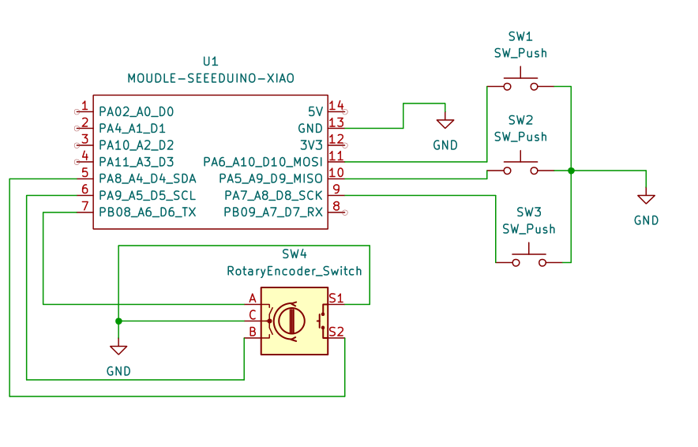
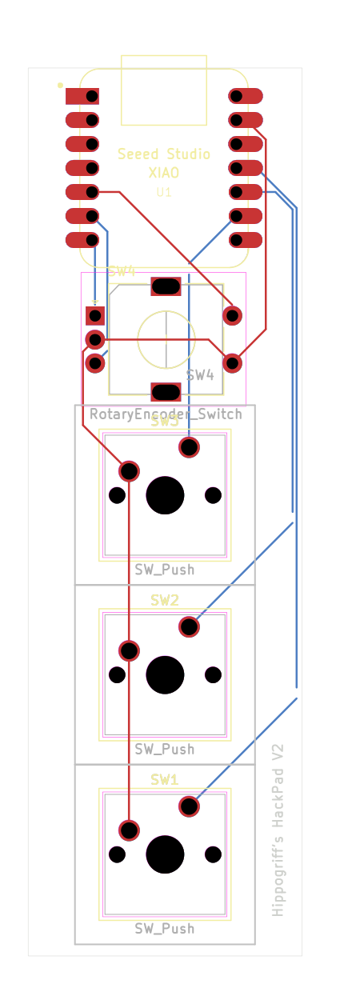
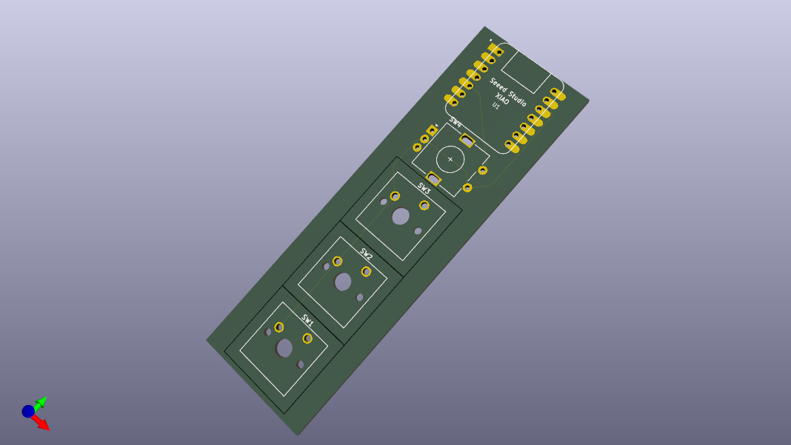

# HippogriffsHackPad
A project for Hack Club's [Blueprint](blueprint.hackclub.com), that ends in _less than_ 24 hours!

_Yes_, I made this in ONE day!

_Yes_, it is probebly not very good!

_Yes_, this is the first time using fusion and second time using KiCad!

### BOM 

_(KiCad made this idk what it means)_

| Reference | Value | Footprint | Datasheet | Qty | DNP | Exclude from BOM | Exclude from Board |
| :--- | :--- | :--- | :--- | :--- | :--- | :--- | :--- |
| SW1, SW2, SW3 | SW_Push | Button_Switch_Keyboard:SW_Cherry_MX_1.00u_PCB | ~ | 3 | | | |
| SW4 | RotaryEncoder_Switch | Rotary_Encoder:RotaryEncoder_Alps_EC11E-Switch_Vertical_H20mm | ~ | 1 | | | |
| U1 | MOUDLE-SEEEDUINO-XIAO | Footprints?:XIAO-Generic-Hybrid-14P-2.54-21X17.8MM | | 1 | | | |

### PCB

Here is some images of the schematic and PCB design I made in KiCad!

> Schematic Editor

> PCB Editor

> 3D Preview of PCB

### CAD

> [`Hippogriff's Hack Pad.stl`](https://github.com/hippogriff101/HippogriffsHackPad/blob/main/CAD/Hippogriff's%20Hack%20Pad.stl)

### Blueprint Requirments

#### What is my project, how will I use it adn why I made it?

This is a project that follows the [Blueprint Hackpad](https://blueprint.hackclub.com/hackpad/) Guided Project. However, to make it my own I added a Rotary Encoder that I can use to change volume or control lights in my room! The other butttons on my Hackpad could be used to activate certain functions etc. that make my life easier. Now, the reason for making this is, as you can see, I am in first 250 users to create an account and this project was created on Blueprint four months ago but I have only gotten around to making it in the last 10 hours of the event. WHile I'm not the best at hardware I have given it a go and hope to make something cool!
